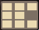

# Hyprkool
An opinionated [Hyprland](https://github.com/hyprwm/Hyprland) plugin that tries to replicate the feel of KDE activities and grid layouts.

# Features
- ability to switch desktops when cursor touches screen edges
- grid layout
- a super simple workspace indicator using waybar

# Limitations
- hyprland plugins can not yet control animation directionality

# Installation
## Cargo
```zsh
git clone https://github.com/thrombe/hyprkool
cd hyprkool
cargo install --path .
```

## Nix
Try it out
```nix
nix run github:thrombe/hyprkool
```

Else add the following to your nix flake
```nix
{
  inputs = {
    ...

    # define flake input
    hyprkool.url = "github:thrombe/hyprkool";
  };

  ...

    # then add it to your environment packages
    packages = [
      inputs.hyprkool.packages."${system}".default
    ];

  ...
}
```

# Example Configs
## Configure hyprkool
~/.config/hypr/hyprkool.toml
```toml
# activity names (first activity is treated as default)
activities = ["my-default-activity", "my-activity"]

# number of workspaces in x and y dimensions
workspaces = [2, 2]

# how often to poll for cursor position
polling_rate = 300 # in ms

# number of pixels to consider as edge
edge_width = 0

# number of pixels to push cursor inside when it loops around
edge_margin = 2
```

## Hyprland config
~/.config/hypr/hyprland.conf
```conf
animations {
  ...

  # animations work fine, but afaik there is no way to control
  # which side the workspaces slide from as a hyprland plugin
  # so i recommend either turning off animations for workspaces
  # or using animation styles that do not have directionality. (eg fade)
  animation = workspaces, 0
}

# Switch activity
bind = $mainMod, TAB, exec, hyprkool next-activity -c

# Move active window to a different acitvity
bind = $mainMod CTRL, TAB, exec, hyprkool next-activity -c -w

# Relative workspace jumps
bind = $mainMod, h, exec, hyprkool move-left -c
bind = $mainMod, l, exec, hyprkool move-right -c
bind = $mainMod, j, exec, hyprkool move-down -c
bind = $mainMod, k, exec, hyprkool move-up -c

# Move active window to a workspace
bind = $mainMod CTRL, h, exec, hyprkool move-left -c -w
bind = $mainMod CTRL, l, exec, hyprkool move-right -c -w
bind = $mainMod CTRL, j, exec, hyprkool move-down -c -w
bind = $mainMod CTRL, k, exec, hyprkool move-up -c -w

# toggle special workspace
bind = $mainMod, SPACE, exec, hyprkool toggle-special-workspace -n minimized
# move active window to special workspace without switching to that workspace
bind = $mainMod, s, exec, hyprkool toggle-special-workspace -n minimized -w -s

# switch workspaces when mouse touches any of the edges
exec-once = hyprkool mouse-loop
```

## Info commands
Hyprkool supports some additional info commands that help you to build widgets using applications like
[waybar](https://github.com/Alexays/Waybar) and [eww](https://github.com/elkowar/eww).

for example, ```hyprkool info -m active-window``` prints the active window information.

Note: the --monitor or -m flag makes this info print in an infinite loop. this however is very efficient
as it is event based and not polling based.
eww (using [`deflisten`](https://github.com/elkowar/eww/blob/f1ec00a1c9a24c0738fb5d5ac309d6af16e67415/docs/src/configuration.md#adding-dynamic-content))
and waybar (using [`exec`](https://github.com/Alexays/Waybar/wiki/Module:-Custom#continuous-script)) both support
this kind of efficient updates.

### Eww config
Example eww config can be found in [my dotfiles](https://github.com/thrombe/dotfiles-promax/blob/9a714cb99af83c60151370565125ca99a1a2bddf/configma/tools/home/.config/eww/eww.yuck)


### Waybar config
it simply uses the unicode Full block characters '█' to show activities.
it looks something like this
<br>


~/.config/waybar/config
```json
{
  ...

  "custom/hyprkool-workspaces": {
    "format": "{}",
    "return-type": "json",
    "exec": "hyprkool info -m waybar-activity-status"
  },
  "custom/hyprkool-window": {
    "format": "{}",
    "return-type": "json",
    "exec": "hyprkool info -m waybar-active-window",
  },
}
```

~/.config/waybar/style.css
```css
#custom-hyprkool-workspaces {
  border: none;
  font-size: 7px;
  color: #ebdbb2;
  background: #7c6f64;
  border-radius: 3px;
  padding: 2px;
  margin: 1px;
}
```
